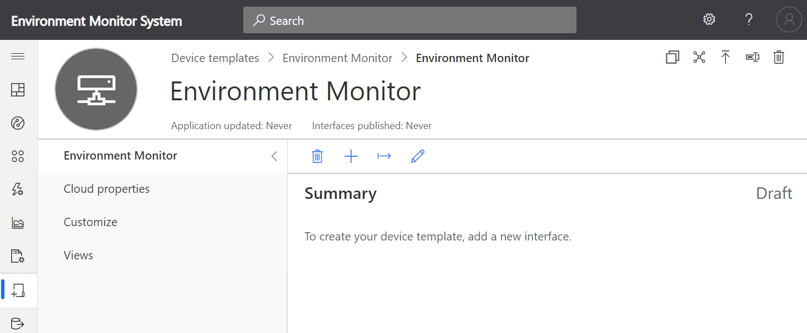
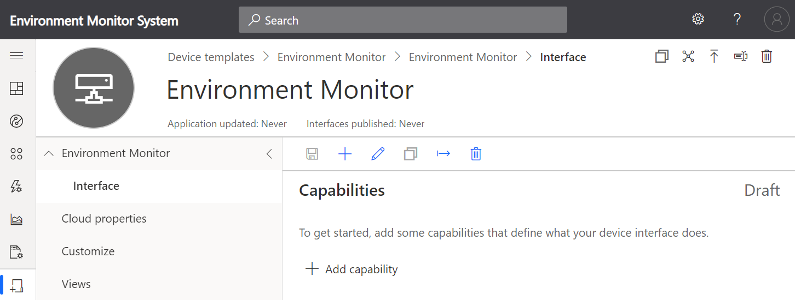
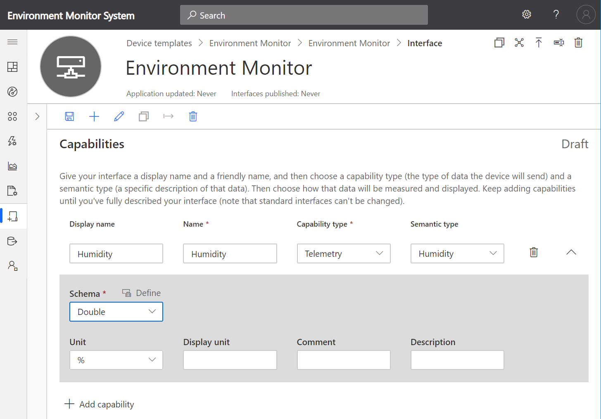
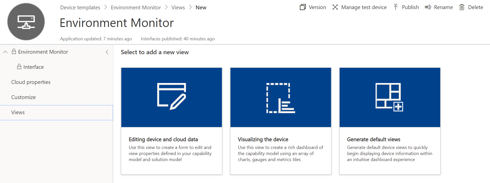
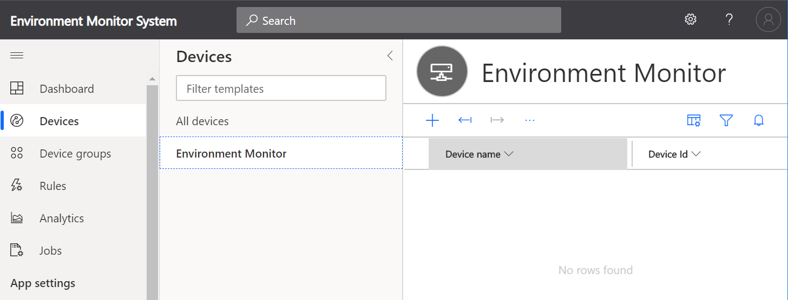

# PyLab 2: Raspberry Pi, Azure IoT Central, and Docker Container Debugging

Follow me on Twitter [@dglover](https://twitter.com/dglover)


|Author|[Dave Glover](https://developer.microsoft.com/en-us/advocates/dave-glover?WT.mc_id=pycon-blog-dglover), Microsoft Cloud Developer Advocate |
|:--- |:--- |
|Platforms | Linux, macOS, Windows, Raspbian Buster|
|Services | [Azure IoT Central](https://docs.microsoft.com/en-us/azure/iot-central/?WT.mc_id=pycon-blog-dglover) |
|Tools| [Visual Studio Code](https://code.visualstudio.com?WT.mc_id=pycon-blog-dglover)|
|Hardware | [Raspberry Pi](https://www.raspberrypi.org/products/raspberry-pi-4-model-b/), [Raspberry Pi Sense HAT](https://www.raspberrypi.org/products/sense-hat/)|
|Language| Python|
|Date|September, 2019|

## PDF Lab Guide

You may find it easier to download and follow the PDF version of the **Raspberry Pi, Python, Azure IoT Central, and Docker Container Debugging** PyLab.

- [English Lab Guide](https://github.com/gloveboxes/PyLab-2-Python-Azure-IoT-Central-and-Docker-Container-Debugging/blob/master/README.pdf)
<!-- - [简体中文实验室指南](https://github.com/gloveboxes/PyLab-2-Python-Azure-IoT-Central-and-Docker-Container-Debugging/blob/master/PyLab-2-Raspberry-Pi-Azure-IoT-Central-and-Docker-Container-Debugging_Chinese.pdf) -->

## PyLab Content

- [PyLab 1: Raspberry Pi, Debugging a Python Internet of Things Application](https://gloveboxes.github.io/PyLab-1-Debugging-a-Python-Internet-of-Things-Application/)
- [PyLab 2: Raspberry Pi, Azure IoT Central, and Docker Container Debugging](https://gloveboxes.github.io/PyLab-2-Python-Azure-IoT-Central-and-Docker-Container-Debugging/)

## Introduction

In this hands-on lab, you will learn how to create a Python Internet of Things (IoT) application with [Visual Studio Code](https://code.visualstudio.com/?WT.mc_id=pycon-blog-dglover). Run the application  in a Docker Container on a Raspberry Pi, read temperature, humidity, and air pressure telemetry from a sensor, and finally debug the application running in the Docker Container.

## PyLab Set Up

<!-- - [Single-User Set Up](https://github.com/gloveboxes/PyLab-0-Raspberry-Pi-Set-Up/tree/master/setup-singleuser/README.md)

This automated set up installs the required libraries, Docker, and builds the lab docker images.

 -->

### Multi-User Set Up

[Multi-User Set Up](https://github.com/gloveboxes/PyLab-0-Raspberry-Pi-Set-Up/tree/master/setup-multiuser/README.md)

The Multi-user set up allows up to 20 users/students per Raspberry Pi 4 4GB. A USB3 SSD or fast Flash drive is required to support the disk IO requirements for this number of users. The installation script installs the lab content, and Docker. Builds the lab Docker Images, and sets up all the users.


<!-- ## CircuitPython

[CircuitPython](www.circuitpython.org), an [Adafruit](www.adafruit.com) initiative, is built on the amazing work of Damien George and the MicroPython community. CircuitPython adds hardware support for Microcontroller development and simplifies some aspects of MicroPython. MicroPython and by extension, CircuitPython implements version 3 of the Python language reference. So, your Python 3 skills are transferrable.

CircuitPython runs on over 60 **Microcontrollers** as well as the **Raspberry Pi**. This means you build applications that access GPIO hardware on a Raspberry Pi using CircuitPython libraries.

The advantage of running CircuitPython on the Raspberry Pi is that there are powerful Python debugging tools available. If you have ever tried debugging applications on a Microcontroller, then you will appreciate it can be painfully complex and slow. You resort to print statements, toggling the state of LEDs, and worst case, using specialized hardware.

With Raspberry Pi and CircuitPython, you build and debug on the Raspberry Pi, when it is all working you transfer the app to a CircuitPython Microcontroller. You need to ensure any libraries used are copied to the Microcontroller, and pin mappings are correct. But much much simpler!

This hands-on lab uses CircuitPython libraries for GPIO, I2C, and the BME280 Temperature/Pressure/Humidity sensor. The CircuitPython libraries are installed on the Raspberry Pi with pip3.

```bash
pip3 install adafruit-blinka adafruit-circuitpython-bme280
``` -->

## Software Installation


This hands-on lab uses Visual Studio Code. Visual Studio Code is a code editor and is one of the most popular **Open Source** projects on [GitHub](https://github.com/microsoft/vscode). It runs on Linux, macOS, and Windows.

### Install Visual Studio Code

1. **Install [Visual Studio Code](https://code.visualstudio.com/Download?WT.mc_id=pycon-blog-dglover)**

#### Visual Studio Code Extensions

The features that Visual Studio Code includes out-of-the-box are just the start. VS Code extensions let you add languages, debuggers, and tools to your installation to support your development workflow.

#### Browse for extensions

You can search and install extensions from within Visual Studio Code. Open the Extensions view from the Visual Studio Code main menu, select **View** > **Extensions** or by clicking on the Extensions icon in the **Activity Bar** on the side of Visual Studio Code.


This will show you a list of the most popular VS Code extensions on the [VS Code Marketplace](https://marketplace.visualstudio.com/VSCode?WT.mc_id=pycon-blog-dglover).

<!--  -->


### Install the Python, Remote SSH, and Docker Extensions

Search and install the following two Visual Studio Code Extensions published by Microsoft.

1. **[Python](https://marketplace.visualstudio.com/items?itemName=ms-python.python&WT.mc_id=pycon-blog-dglover)**
2. **[Remote - SSH](https://marketplace.visualstudio.com/items?itemName=ms-vscode-remote.remote-ssh&WT.mc_id=pycon-blog-dglover)**
3. **[Docker Extension](https://marketplace.visualstudio.com/items?itemName=ms-azuretools.vscode-docker&WT.mc_id=pycon-blog-dglover)**

## Remote SSH Development

The Visual Studio Code Remote - SSH extension allows you to open a remote folder on any remote machine, virtual machine, or container with a running SSH server and take full advantage of Visual Studio Code.


## Raspberry Pi Hardware

You need the following information:

1. The **Network Address** of the Raspberry Pi
2. Your Raspberry Pi **login name** and **password**.

## SSH Authentication with private/public keys


Setting up a public/private key pair for [SSH](https://en.wikipedia.org/wiki/Secure_Shell) authentication is a secure and fast way to authenticate from your computer to the Raspberry Pi. This is recommended for this hands-on lab.

### SSH Set up for Windows Users

The SSH utility guides you through the process of setting up a secure SSH channel for Visual Studio Code and the Raspberry Pi.

You will be prompted for:

- The Raspberry Pi Network IP Address,
- The Raspberry Pi login name and password

1. From **Windows File Explorer**, open **ftp://\<Raspberry Pi Address>**

    <br>

    

    <br>

2. Copy the **scripts** directory to your **desktop**

    <br>

    

    <br>

3. Open the **scripts** folder you copied to your **desktop**
4. Double click the **windows-setup-ssh.cmd**

### SSH Set up for Linux and macOS Users

The SSH utility guides you through the process of setting up a secure SSH channel for Visual Studio Code and the Raspberry Pi

You will be prompted for:

- The Raspberry Pi Network IP Address,
- The Raspberry Pi login name and password

1. Open a Terminal window
2. Copy and paste the following command, and press **ENTER**

    ```bash
    read -p "Enter the Raspberry Pi Address: " pyurl && \
    curl ftp://$pyurl/scripts/ssh-setup.sh | bash
    ```

<!--
### SSH for Windows 10 (1809+) Users with PowerShell

1. Start PowerShell as Administrator and install OpenSSH.Client

    ```bash
        Add-WindowsCapability -Online -Name OpenSSH.Client
    ```

2. **Exit** PowerShell
3. Restart PowerShell (**NOT** as Administrator)
4. Create an SSH Key

    ```bash
    ssh-keygen -t rsa -f $env:userprofile\.ssh\id_rsa_python_lab
    ```

5. Copy SSH Key to Raspberry Pi

    ```bash
    cat $env:userprofile\.ssh\id_rsa_python_lab.pub | ssh `
    <login@Raspberry IP Address> `
    "mkdir -p ~/.ssh; cat >> ~/.ssh/authorized_keys"
    ```

6. Test the SSH Authentication Key

    ```bash
    ssh -i $env:userprofile\.ssh\id_rsa_python_lab <login@Raspberry IP Address>
    ```

    A new SSH session will start. You should now be connected to the Raspberry Pi **without** being prompted for the password.

7. Close the SSH session. In the SSH terminal, type exit, followed by ENTER.

### SSH for earlier versions of Windows

[SSH for earlier versions of Windows](https://github.com/gloveboxes/PyCon-Hands-on-Lab/blob/master/Lab2-docker-debug/resources/windows-ssh.md)

-->

## Start a Remote SSH Connection

1. **Start Visual Studio Code**
2. Press **F1** to open the Command Palette, type **ssh connect** and select **Remote-SSH: Connect to Host**

3. Select the **pylab-devnn** configuration

    <br>

    

    <br>
4. Check the Remote SSH has connected. 

    It will take a moment to connect, then the SSH Status in the bottom lefthand corner of Visual Studio Code will change to **>< SSH:pylab-devnn**.  Where devnn is your Raspberry Pi Login name.

    <br>

    

## Introduction to Docker

[Jake Wright's Docker in 12 Minutes](https://www.youtube.com/watch?v=YFl2mCHdv24&t=364s) is a great introduction to Docker.


## Open the PyLab 2 Docker Debug Project

1. From Visual Studio Code main menu: **File** > **Open Folder**
2. Select the **PyLab** directory
    <br/>

    

    <br/>
3. Next select, the **PyLab-2-Docker-Debug/** directory
    <br/>

    

    <br/>
4. Click **OK** to Open the directory
5. From the **Explorer** bar, open the **app** folder, then the **app.py** file, and review the contents
    <br/>

    

<br/>

## Creating an Azure IoT Central Application

### What is Azure IoT Central

Easily connect, monitor and manage your Internet of Things (IoT) assets at scale. [Azure IoT Central](https://azure.microsoft.com/en-in/services/iot-central/?WT.mc_id=pycon-blog-dglover) is a hosted, extensible software as a service (SaaS) platform that simplifies setup of your IoT solution and helps reduce the burden and costs of IoT management, operations and development. Provide customers superior products and service while expanding your business possibilities.


We are going to create an Azure IoT Central application, then a device, and finally a device **connection string** needed for the application that will run in the Docker container.


## Create a New IoT Central Application

1. Open the [Azure IoT Central](https://azure.microsoft.com/en-au/services/iot-central/?WT.mc_id=pycon-blog-dglover) in a new browser tab, then click **Getting started**.

2. Next, you will need to sign with your **Microsoft** Personal, or Work, or School account. If you do not have a Microsoft account, then you can create one for free using the **Create one!** link.

    

3. Create a new Azure IoT Central application, select **New Application**. This takes you to the **Create Application** page.

4. Select **Build as app**


5. Select **Custom app**
<br/>
    
<br/>
### Create a **New application**

Specify **Application name**, **URL**, enable **7 day free trial**, and complete the registration form. Then click **Create**.


1. Add new Device Template

    Click **Device templates"
<br/>
    
<br/>
2. Select **IoT device** template type
<br/>
    
<br/>
3. Create an **IoT Device** Template
<br/>
    1. Select **IoT device**, 
    2. Click **Next:Customise**, 
    3. Click **Next: Review**, 
    4. Click **Create**.
    5. Name your template, and press **Enter**


#### Create a Capability Model

1. Add an Interface

    1. Click **Custom**, 
    2. Click the **+** symbol to add an **Interface**. 
    3. Choose **Custom** interface.
<br/>

    
<br/>
2. Add Capabilities
<br/>
    
<br/>
    Click **<** (Collapse) to create more working space.
<br/>
3. Add **Humidity** Capability
    1. Click **+** to Add capability.
    1. Add **Humidity** Telemetry Capability
    2. Set the Unit to **%**
<br/>
    
<br/>

4. Add **Temperature** and **Pressure** Capabilities
<br/>

    
<br/>

4. Save the Capabilities

    Click **Save** to save the capabilities model.

#### Create a Device Template View

1. Click **Views**
2. Click **Generate default views**
3. Click **Generate default dashboard view(s)**
4. You can customize the default view later.
    <br/>
    
    <br/>
#### Publish the Template

Click **Publish** to activate the template.


### Create a new device

1. Select Devices from IoT Central **Side Bar** menu
2. Select the Template you just created
<br/>
    
<br/>
3. Click **+** to add a new device
<br/>
    
<br/>
1. Set the Device ID and the Display name
2. Click **Create**


#### Approve the device

1. Select the newly created device
2. Click **Approve**
<br/>
    
<br/>

### Connect the Device

When you have created your real device click the **Connect** button in the top right-hand corner of the screen to display the device credentials.
<br/>

<br/>    
**Leave this page open as you will need this connection information for the next step in the hands-on lab.**


## Configure the Python Application

1. Switch back to Visual Studio Code. Open the **env-file** (environment file). This file contains environment variables that will be passed to the Docker container.

2. Paste the Scope ID, Device ID, and Primary Key into the env-file.
    <br/>
    For example:

    ```text
    SCOPE=0ne00012345
    DEVICE_ID=rpi-device
    KEY=dB0g7hikas9isvYfYkqCofRpFl7VoXCGuuNOvCa1aK8=
    ```

3. Save the env-file file (Ctrl+S)

<!-- 4. Ensure **Explorer** selected in the activity bar, right mouse click file named **Dockerfile** and select **Build Image**.


5. Give your docker build image a **unique name** - eg the first part of your email address, your nickname, something memorable, followed by **:latest**. The name needs to be unique otherwise it will clash with others building Docker images on the same Raspberry Pi.

    For example **glovebox:latest**

 -->

### How Debugging a Python App in a Docker Container Works

- Each User Profile (**\$USER**) has a Unique (**\$LAB_PORT**) Environment Variable that is set when you log into the Raspberry Pi (.bashrc).
- The follow happens when you start a Visual Studio Code Docker container debug session:

    1. A Docker container named \$USER is built to include your Python Code (docker build)
    2. Docker maps \$LAB_PORT to Port 3000 in the container (-p \$LAB_PORT:3000).
    If you review the **.vscode/task.json** file you will see the Docker commands that run when you start the debugger.
    3. The Docker Container is started (docker run –p \$LAB_PORT:3000)
    4. One of the first lines of code in the **app.py** file is to start the _ptvsd_ (Python Tools for Visual Studio Debugger) debugger to listen on port 3000.

        ```python
        ptvsd.enable_attach(address=('0.0.0.0', 3000))
        ```

    5. Next the Visual Studio Code debugger attaches to \$LAB_PORT that is mapped through to port 3000. This is the port that the Visual Studio Python Debugger is listening on in the container. Review the **.vscode/launch.json** file to understand how the debugger attach works.
    6. Now you can start stepping through the Python code, set breakpoints, inspect variables etc.

    

### Build and Run the Docker Image

Press **F5** to start debugging the Python application. The process will first build and then start the Docker Container. When the Docker Container has started the Visual Studio Code Debugger will attach to the running application.

There are two configuration files found in the .vscode folder that are responsible for running and debugging the Python application. You can find more detail the [Debugger Configuration](#debugger-configuration) appendix.

## Set a Visual Studio Debugger Breakpoint

1. From **Explorer** on the Visual Studio Code activity bar, open the **app.py** file
1. Set a breakpoint at line 66, **temperature, pressure, humidity, timestamp = mysensor.measure()** in the **publish** function.

    - You can set a breakpoint by doing any one of the following:

        - With the cursor on that line, press F9, or,
        - With the cursor on that line, select the Debug > Toggle Breakpoint menu command, or, click directly in the margin to the left of the line number (a faded red dot appears when hovering there). The breakpoint appears as a red dot in the left margin:

    

### Debug actions

Once a debug session starts, the **Debug toolbar** will appear at the top of the editor window.


The debugger toolbar (shown above) will appear in Visual Studio Code. It has the following options:

1. Pause (or Continue, F5),
2. Step Over (F10)
3. Step Into (F11),
4. Step Out (Shift+F11),
5. Restart (Ctrl+Shift+F5),
6. and Stop (Shift+F5).

### Step through the Python code

1. Press **F10**, or from the Debugger Toolbar, click **Step Over** until you are past the **print(telemetry)** line of code.
2. Explore the **Variable Window** (Ctrl+Shift+Y). Try changing variable values.
3. Explore the **Debug Console**. You will see sensor telemetry and the results of sending the telemetry to Azure IoT Central.
    
4. From the **Debug** Menu -> **Disable All Breakpoints**
5. Press **F5** or from the Debugger Toolbar, click **Continue** so the Python application runs and streams telemetry to **Azure IoT Central**.

## Exploring Device Telemetry in Azure IoT Central

1. Use **Device** to navigate to the **Measurements** page for the real Raspberry Pi device you added:

    

1. On the **Measurements** page, you can see the telemetry streaming from the Raspberry Pi device:

    

## Finished

 

## Appendix

### Debugger Configuration

There are two files (launch.json and tasks.json) found in the .vscode folder that are responsible for the running and debugging the application.

#### Launch Configuration

Creating a launch configuration file is useful as it allows you to configure and save debugging setup details.

**launch.json**

```json
{
    // Use IntelliSense to learn about possible attributes.
    // Hover to view descriptions of existing attributes.
    // For more information, visit: https://go.microsoft.com/fwlink/?linkid=830387
    "version": "0.2.0",
    "configurations": [
        {
            "name": "Attach Debugger",
            "preLaunchTask": "start-docker",
            "postDebugTask": "stop-docker",
            "type": "python",
            "request": "attach",
            "pathMappings": [
                {
                    "localRoot": "${workspaceRoot}/app",
                    "remoteRoot": "/app"
                }
            ],
            "port": "${env:LAB_PORT}",
            "host": "localhost"
        },
        {
            "name": "Stop Container",
            "preLaunchTask": "stop-docker",
            "type": "python",
            "request": "launch"
        }
    ]
}
```

#### Tasks Configuration

Tasks integrate external tools to automate build cycle.

**tasks.json**

```json
{
    // See https://go.microsoft.com/fwlink/?LinkId=733558
    // for the documentation about the tasks.json format
    "version": "2.0.0",
    "tasks": [
        {
            "label": "start-docker",
            "type": "shell",
            "command": "sh",
            "args": [
                "-c",
                "\"docker build -t $USER:latest . ;docker run -d -p $LAB_PORT:3000 -e TELEMETRY_HOST=$LAB_HOST --env-file env-file --name $USER --rm  $USER:latest; sleep 1 \""
                // -d Run container in background and print container ID,
                // -p maps the $LAB_PORT to port 3000 in the container, this port is used for debugging,
                // -e Environment Variable. The IP Address of the telemetry service.
                // --env-file reads from a file and sets Environment Variables in the Docker Container,
                // --name names the Docker Container
                // --rm removes the container when you stop it
                // Docker run reference https://docs.docker.com/engine/reference/run/
            ],
        },
        {
            "label": "stop-docker",
            "type": "shell",
            "command": "sh",
            "args": [
                "-c",
                "\"docker stop $USER\""
            ]
        }
    ]
}
```


### Azure IoT Central

#### Take a tour of the Azure IoT Central UI

This article introduces you to the Microsoft Azure IoT Central UI. You can use the UI to create, manage, and use an Azure IoT Central solution and its connected devices.

As a _builder_, you use the Azure IoT Central UI to define your Azure IoT Central solution. You can use the UI to:

- Define the types of device that connect to your solution.
- Configure the rules and actions for your devices.
- Customize the UI for an _operator_ who uses your solution.

As an _operator_, you use the Azure IoT Central UI to manage your Azure IoT Central solution. You can use the UI to:

- Monitor your devices.
- Configure your devices.
- Troubleshoot and remediate issues with your devices.
- Provision new devices.

#### Use the left navigation menu

Use the left navigation menu to access the different areas of the application. You can expand or collapse the navigation bar by selecting **<** or **>**:


#### Search, help, and support

The top menu appears on every page:


- To search for device templates and devices, enter a **Search** value.
- To change the UI language or theme, choose the **Settings** icon.
- To sign out of the application, choose the **Account** icon.
- To get help and support, choose the **Help** drop-down for a list of resources. In a trial application, the support resources include access to [live chat](https://docs.microsoft.com/en-us/azure/iot-central/howto-show-hide-chat?WT.mc_id=pycon-blog-dglover).

You can choose between a light theme or a dark theme for the UI:


#### Dashboard


The dashboard is the first page you see when you sign in to your Azure IoT Central application. As a builder, you can customize the application dashboard for other users by adding tiles. To learn more, see the [Customize the Azure IoT Central operator's view](https://docs.microsoft.com/en-us/azure/iot-central/tutorial-customize-operator?WT.mc_id=pycon-blog-dglover) tutorial. Users can also [create their own personal dashboards](https://docs.microsoft.com/en-us/azure/iot-central/howto-personalize-dashboard?WT.mc_id=pycon-blog-dglover).

#### Device explorer


The explorer page shows the _devices_ in your Azure IoT Central application grouped by _device template_.

* A device template defines a type of device that can connect to your application. To learn more, see the [Define a new device type in your Azure IoT Central application](https://docs.microsoft.com/en-us/azure/iot-central/tutorial-define-device-type?WT.mc_id=pycon-blog-dglover).
* A device represents either a real or simulated device in your application. To learn more, see the [Add a new device to your Azure IoT Central application](https://docs.microsoft.com/en-us/azure/iot-central/tutorial-add-device?WT.mc_id=pycon-blog-dglover).

#### Device sets


The _device sets_ page shows device sets created by the builder. A device set is a collection of related devices. A builder defines a query to identify the devices that are included in a device set. You use device sets when you customize the analytics in your application. To learn more, see the [Use device sets in your Azure IoT Central application](https://docs.microsoft.com/en-us/azure/iot-central/howto-use-device-sets?WT.mc_id=pycon-blog-dglover) article.

#### Device Templates


The device templates page is where a builder creates and manages the device templates in the application. To learn more, see the [Define a new device type in your Azure IoT Central application](https://docs.microsoft.com/en-us/azure/iot-central/tutorial-define-device-type?WT.mc_id=pycon-blog-dglover) tutorial.

#### Analytics


The analytics page shows charts that help you understand how the devices connected to your application are behaving. An operator uses this page to monitor and investigate issues with connected devices. The builder can define the charts shown on this page. To learn more, see the [Create custom analytics for your Azure IoT Central application](https://docs.microsoft.com/en-us/azure/iot-central/howto-use-device-sets?WT.mc_id=pycon-blog-dglover) article.

#### Jobs


The jobs page allows you to perform bulk device management operations onto your devices. The builder uses this page to update device properties, settings, and commands. To learn more, see the [Run a job](https://docs.microsoft.com/en-us/azure/iot-central/howto-run-a-job?WT.mc_id=pycon-blog-dglover) article.

#### Continuous Data Export


The continuous data export page is where an administrator defines how to export data, such as telemetry, from the application. Other services can store the exported data or use it for analysis. To learn more, see the [Export your data in Azure IoT Central](https://docs.microsoft.com/en-us/azure/iot-central/howto-export-data?WT.mc_id=pycon-blog-dglover) article.

#### Administration


The administration page contains links to the tools an administrator uses such as defining users and roles in the application. To learn more, see the [Administer your Azure IoT Central application](https://docs.microsoft.com/en-us/azure/iot-central/howto-administer?WT.mc_id=pycon-blog-dglover) article.


## References

- [Visual Studio Code](https://code.visualstudio.com/?WT.mc_id=pycon-blog-dglover)
- [Azure IoT Central](https://azure.microsoft.com/en-au/services/iot-central?WT.mc_id=pycon-blog-dglover)
- [Installing Docker on Raspberry Pi Buster](https://dev.to/azure/azure-iot-edge-on-raspberry-pi-buster-plus-tips-for-raspberry-pi-4-22nn)
- [Understanding Docker in 12 Minutes](https://www.youtube.com/watch?v=YFl2mCHdv24&t=358s)
